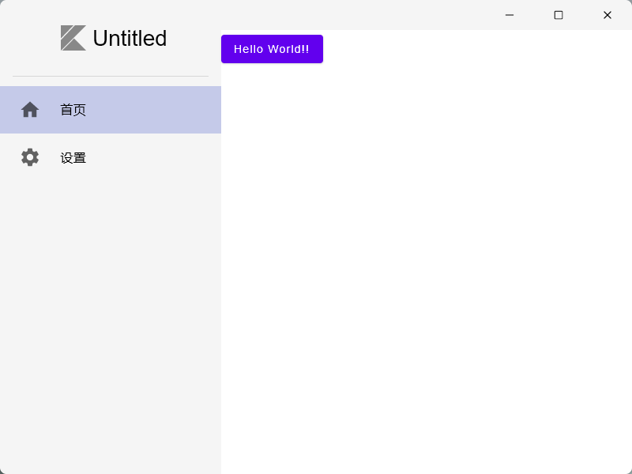

# Jetpack Compose Desktop Scaffold (compose-jb)

Jetpack Compose Desktop Scaffold (jp-desktop) ， (由于compose-jb更新频繁，项目结构后续可能发生变化)直接下载复制到项目即可，

脚手架样式

* ClassicWindowScaffold    (经典Windows脚手架)

* PanelWindowScaffold    (面板样式脚手架)

  